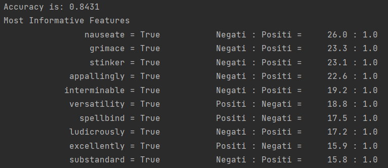
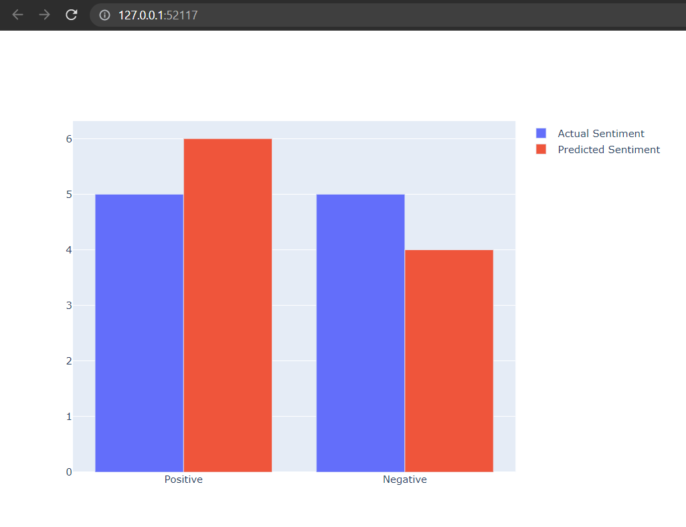

# MINDS Summer Challenge

This is a repository holding code and explanations for the summer MINDS challenge, involving web scraping of new articles and sentiment analysis of the articles/

The project was done using `Python-3.10` and multiple packages were used as documented:

### Web Scraping 

1. Beautifulsoup4 - For parsing of the HTML data from resource URL.
2. Requests - For making API calls to the resource URL and obtaining HTML.

### Sentiment Analysis

1. NLTK - Package that provides tools for working with data dealing with human language.
2. Pandas - For holding the dataset into dataframes.
3. Plotly - Visualization of results from sentiment analysis of news articles.
4. tqdm - To display progress bars.

A full list of packages can be found [here](requirements.txt).

---

## Running the script

There are 2 scripts `main.py` and  `sentiment_analysis.py` that are used to get articles from resource URL and performing sentiment analysis on the resultant JSON data, respectively.

Originally, conda was used to create and manage virtual environment for the project. Prior to running the script, please install the list of dependencies from `requirements.txt` which can be found [here](requirements.txt).

-- Invoking `main.py`:

`python main.py`

This will create an articles.json in the project directory.

-- Invoking `sentiment_analysis.py`:

`python sentiment_analysis.py`

---

## Article Scraping

News articles were scraped from `https://www.aljazeera.com/where/mozambique/` and the articles are stored in an `articles.json` file, also included in the repository [here](articles-long.json).

The file `articles.json` follows the schema:

```angular2html
    title: str
    content: str | None
    reference: str
```

* Title - Mentions the title of the news article.
* Content - The actual content of the news article.
* Reference - The URL from where the contect of the news article could be fetched.

Article scraping is done in 2 steps:
1. Fetch the article title and the resource URL of that news article (stored in title and reference keys) from the URL mentioned above.
2. Use the second resource URL to fetch the full length content and write to json file.

---

## Sentiment Analysis

The dataset primarily used here is the `movie_reviews` corpus from NLTK.

The package of choice for sentiment analysis is `nltk` (Natural Language Toolkit). At the start, the script will download multiple nltk's resources which are used in the project:
1. stopwords 
2. movie_reviews
3. punkt
4. wordnet
5. averaged_perceptron_tagger

### Data Pre-Processing and Cleaning

Data cleaning is done in multiple steps as documented:

1. **Tokenization** - Breaking of sentences into words to use a bag of words model. Uses NLTK's word_tokenize (which internally uses punkt unsupervised model)


2. **POS tagging** - Parts of speech tagging is required for lemmatization to reduce the word to its base word.


3. **Lemmatization** - Used to reduce the words from tokenization to its base form.


4. **Stopwords Removal** - Removal of stopwords from the text. Uses NLTK stopwords corpups.


5. **Punctuation Removal** - Removal of punctuations, uses python's string.punctuation as string of punctuation.


6. **Preparation of cleaned data for NLTK NV Bayes Classifier** - Creating a list of tokens for Naive Bayes Classifier.


7. **Train test split** - Standard 80-20 split into train-test datasets.


8. **Testing the classifier and Accuracy**

### Results

The accuracy of the model on the test data is 84%



Applying the trained model on news articles also produces accurate results on manual verification, as shown (Produced via Plotly):



The runtime of the script on data is **7.844 minutes** working on dataset with 50,000 records.
